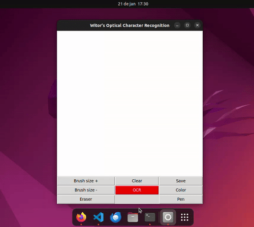

# Witor's Optical Character Recognition

This Python program is a basic OCR made with [Pytesseract](https://pypi.org/project/pytesseract/). It is capable of recognizing letters and phrases drawn in the canvas.

## Dependencies

In order to run the program, you'll need Tesseract installed.

Debian-based operating systems:
```bash
sudo apt-get install tesseract-ocr tesseract-ocr-por
```

MacOS (using Homebrew)
```bash
brew install tesseract
```

Windows 

install it from [here](https://github.com/UB-Mannheim/tesseract/wiki)

You'll also need the following python libraries installed:

- [Tkinter](https://docs.python.org/3/library/tkinter.html)
- [Pillow](https://pypi.org/project/pillow/)
- [Pytesseract](https://pypi.org/project/pytesseract/)

Install them using pip

```bash
pip install Tk Pillow Pytesseract
```

## Installation

Using git, clone the repository.

```bash
git clone https://github.com/gabrielwitor/Simple-OCR.git
```

## Usage

Run the main.py file
```bash
python main.py
```
Write in the canvas and click on the OCR button.

 

## Contributing

Pull requests are welcome. For major changes, please open an issue first
to discuss what you would like to change.

Please make sure to update tests as appropriate.

## License

[MIT](https://choosealicense.com/licenses/mit/)